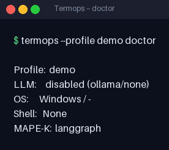
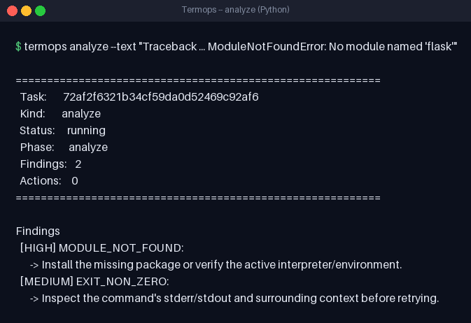
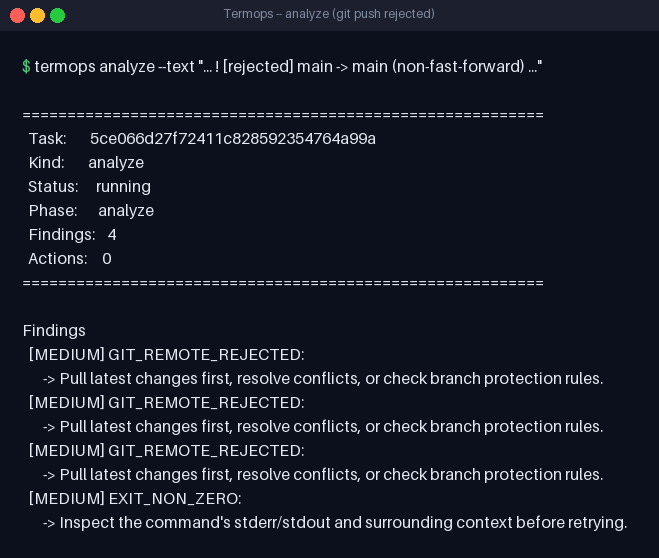
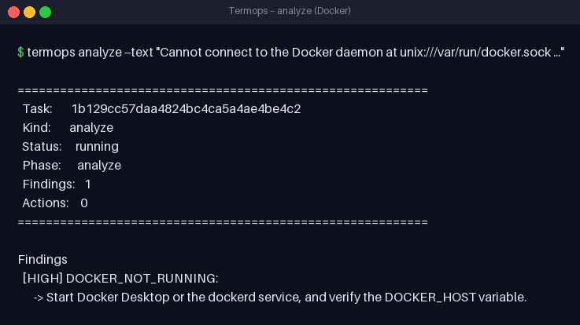
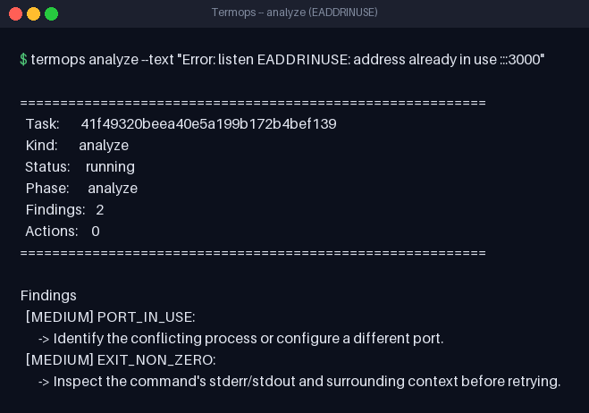
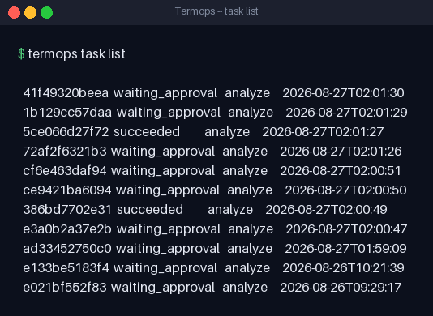
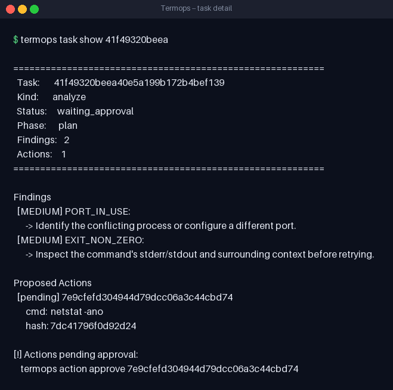
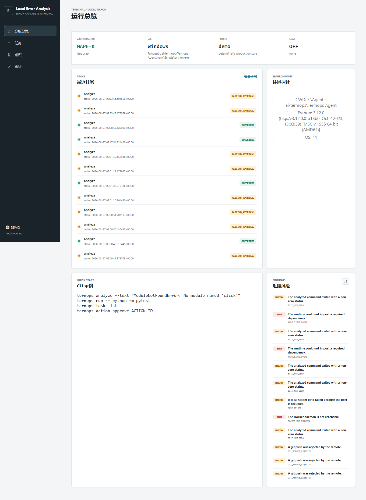
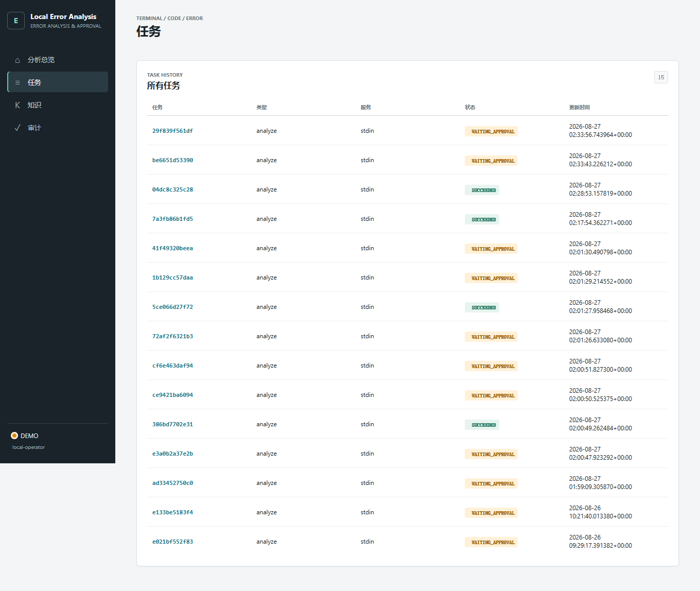
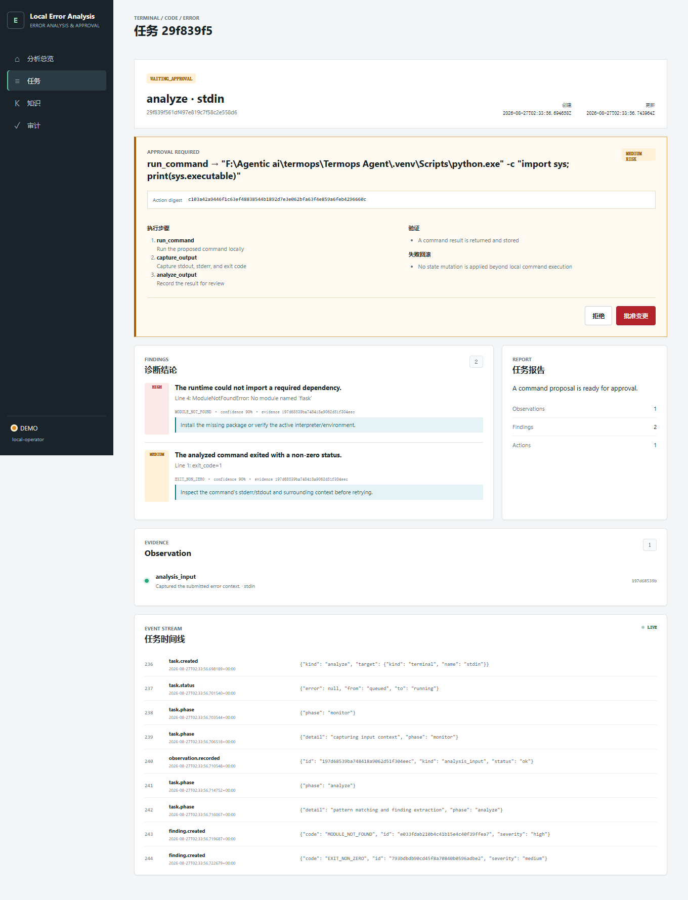

# Termops — an AI agent that reads your terminal

[](https://www.python.org/)
[](./LICENSE)

[中文文档](./README_zh.md)

## Why this exists

Anyone who lives in a terminal knows the loop: a command fails, a wall of red text scrolls by, and you copy the error, paste it into a search box or a chat window, wait for an answer, run the fix, fail again, copy again. The loop is fully manual, and every context switch interrupts the work you were actually doing.

Termops automates that loop. It is a local daemon that takes the failing output of your terminal — auto-captured by a shell hook, or pasted by hand — and handles it the way an experienced colleague would: it recognizes the error, weighs your environment, and proposes a root cause and a fix. And unlike a chatbot, **it never acts on its own**: any command that could change your system must be approved by you first.

In one line: Termops = automatic error capture + deterministic rule classification + LLM root-cause attribution + human approval gating.

## How it analyzes a terminal error

An incoming error is not dumped whole into a model and left to free-form. It flows through a clear pipeline (internally a MAPE-K control loop implemented with LangGraph):

```text
capture ──▶ classify ──▶ attribute ──▶ plan ──▶ approve ──▶ execute & verify ──▶ remember
```

1. **Capture** — Termops collects more than stderr: the command that ran, its exit code, the working directory, and an environment snapshot (OS, interpreters, relevant env vars). Context is what makes analysis good.
2. **Classify** — a built-in deterministic pattern library fingerprints the text first: `ModuleNotFoundError`, `permission denied`, `EADDRINUSE`, `non-fast-forward`… each pattern maps to a severity and a default recommendation. This layer needs no network and no model, so Termops produces readable analysis even with zero LLM configuration (every screenshot below is from this mode).
3. **Attribute** — this is where the LLM comes in. The model receives the raw error, the rule-layer findings, and the environment snapshot, and returns structured JSON: the most likely root cause, a confidence score, remediation steps, and — when warranted — a single proposed verification command. If no model is configured or the call fails, Termops degrades gracefully to the rule layer; the pipeline never blocks.
4. **Plan & approve** — any state-changing action is frozen as a *pending* action with a SHA-256 digest, waiting for your `approve`. Actions expire after 15 minutes and cannot be replayed.
5. **Remember** — which fixes succeeded, which findings were false positives, and your approve/reject decisions are persisted to a local SQLite store, so the next similar error meets an agent with a memory.

## Quick start

### Install

```bash
git clone https://github.com/hxd71/Termops.git
cd Termops
python -m venv .venv
source .venv/bin/activate   # Windows: .venv\Scripts\activate
pip install -e ".[dev]"
```

All you need is Python 3.10+. The rule core works out of the box with no external services.

### Start the daemon and run your first analysis

```bash
termops-agent --profile demo

# in another terminal
termops analyze --text "ModuleNotFoundError: No module named 'click'"
```

Besides `--text`, errors can be fed in other ways:

```bash
termops analyze --file error.log           # read from a log file
termops run -- python -c "import missing"  # wrap a command and capture its output
echo "ImportError: ..." | termops analyze  # pipe from stdin
```

### Tasks & approval

Every analysis is a task with a visible lifecycle:

```text
queued → running → waiting_approval → executing → verifying → succeeded
```

```bash
termops task list                    # list tasks
termops task show <task-id>          # findings and pending actions
termops task watch <task-id>         # follow state transitions live
termops action approve <action-id>   # approve an action
termops action reject  <action-id>   # reject it
```

### Web UI

```bash
termops web login   # prints a one-time login link
```

Open `http://127.0.0.1:8923` (loopback only) for a dashboard, task timelines, and an approval panel.

## LLM configuration: the agent's brain

The deterministic rule core is enough to get started, but **the real value of Termops is the LLM attribution layer — the model you plug in *is* the agent's brain**. The most important step of any deployment is telling it which model to think with.

### One-line setup

```bash
# OpenAI
termops config llm --provider openai --model gpt-4o --api-key sk-xxx --enable

# Anthropic
termops config llm --provider anthropic --model claude-sonnet-4-20250514 --api-key sk-ant-xxx --enable

# Ollama: local models, no API key, fully offline
termops config llm --provider ollama --model qwen2.5:7b --enable

# Any OpenAI-compatible endpoint (vLLM, LiteLLM, LocalAI, …)
termops config llm --provider openai_compatible --base-url http://localhost:8080/v1 --model my-model --api-key my-key --enable
```

Configuration is written to `~/.termops/config.toml`. Environment variables also work, which suits containers and CI:

```bash
export TERMOPS_LLM_PROVIDER=openai
export TERMOPS_LLM_API_KEY=sk-xxx
export TERMOPS_LLM_MODEL=gpt-4o
export TERMOPS_LLM_ENABLED=true
```

`termops config show` prints the effective configuration, and `termops doctor` tells you at a glance whether the LLM is wired up.

### Supported providers

| Provider | Key env var | Default model | Default URL |
|---|---|---|---|
| `openai` | `OPENAI_API_KEY` | `gpt-4o` | `https://api.openai.com/v1` |
| `anthropic` | `ANTHROPIC_API_KEY` | `claude-sonnet-4-20250514` | `https://api.anthropic.com/v1` |
| `ollama` | — | `qwen2.5:7b` | `http://localhost:11434/v1` |
| `openai_compatible` | `LLM_API_KEY` | (user-defined) | `http://localhost:8080/v1` |

Keys live in plaintext in the local config file (auto-`chmod 0600`) or in the `TERMOPS_LLM_API_KEY` environment variable — pick one: never in logs, never in the database, never in API responses.

---

## Real output

All screenshots below are genuine local runs (`--profile demo`, rule core, no LLM) — the baseline experience with no model configured.

### Environment check

```bash
termops --profile demo doctor
```



### Error analysis

Missing Python dependency:

```bash
termops analyze --text "Traceback ... ModuleNotFoundError: No module named 'flask'" --command "python app.py" --exit-code 1
```



Rejected git push:



Unreachable Docker daemon:



Port already in use (EADDRINUSE):



### Task management

```bash
termops task list
termops task show <task-id>
```





### Web UI

`termops web login` prints a one-time link; open `http://127.0.0.1:8923` (loopback only).

Dashboard:



Task list:



Task detail (MAPE-K timeline and evidence):



---

## Terminal hook: let your shell report its own errors

The hook is a small shell plugin: whenever a command exits non-zero, the stderr is sent to Termops automatically. **It is opt-in** — nothing is captured until you install it.

```bash
termops hook install    # detects PowerShell / Bash / Zsh and shows the profile line to add
termops hook status
termops hook uninstall  # remove at any time
```

Restart your terminal or source your profile to activate.

## Security boundaries

- Approval gating: actions execute only after `approve`; they expire in 15 minutes and carry SHA-256 digests against replay and tampering.
- The action engine exposes no arbitrary shell, file read, or network capability.
- The Web UI binds to `127.0.0.1` only, with HttpOnly + SameSite=Strict cookies.
- Secrets live in the local config file (`0600` permissions) or the environment, never in logs, the database, or API responses.

## CLI cheat sheet

```text
termops analyze [--text TEXT] [--file PATH] [--source LABEL] [--language LANG]
                [--command CMD] [--cwd DIR] [--exit-code N]
termops run [--language LANG] [--cwd DIR] -- <command...>
termops doctor
termops task list|show|watch|cancel
termops action approve|reject ACTION_ID
termops web login
termops hook install|uninstall|status
termops config llm|show
```

Legacy aliases `erra` / `erra-agent` are still installed for backward compatibility.

## Project structure

```text
src/termops/
├── cli.py               CLI commands (analyze, run, hook, config, …)
├── daemon.py            Background daemon entry point
├── config.py            Settings loader (file, env, CLI)
├── engine.py            MAPE-K analysis engine
├── graph.py             LangGraph state machine
├── diagnostics.py       Error fingerprinting & deterministic classification
├── llm.py               LLM provider config models
├── llm_client.py        Multi-provider LLM client (graceful degradation)
├── models.py            Core data models (Task, Action, Finding, …)
├── store.py             SQLite-backed state store with audit chain
├── api.py               FastAPI REST endpoints
├── web.py               Web UI routes
├── providers.py         Read-only environment probes
├── security.py          Token generation, hashing, redaction
├── templates/           Jinja2 HTML templates
└── hooks/
    ├── hook.ps1          PowerShell terminal hook
    └── hook.sh           Bash/Zsh terminal hook
tests/
├── test_cli.py          CLI integration tests
├── test_engine.py       Engine & MAPE-K loop tests
├── test_store.py        State store & audit chain tests
├── test_contracts.py    API contract tests
└── test_api_web.py      Web UI tests
```

## Development

```bash
pytest -q                # tests
ruff check src tests     # lint
mypy src/termops         # type check
```

## License

MIT